# HiT — Hyperbolic Diffusion Transformer

[ Paper (PDF)](final_paper/AML_team3_report_final.pdf)
[ Presentation (PDF)](final_paper/AML_team3_ppt_final.pdf)

## How to run

```bash
# 0. 설치 & 데이터
pip install -r requirements.txt
bash scripts/setup_data.sh --download            # 또는 --source <latent_dir>

# 1. DiT — 모델 크기 / 패치 크기 스케일링
bash scripts/train.sh --config configs/dit_s.yaml    --gpus 0,1,2,3
bash scripts/train.sh --config configs/dit_b.yaml    --gpus 0,1,2,3
bash scripts/train.sh --config configs/dit_l.yaml    --gpus 0,1,2,3
bash scripts/train.sh --config configs/dit_s_p4.yaml --gpus 0,1
bash scripts/train.sh --config configs/dit_s_p8.yaml --gpus 0,1

# 2. HiT
bash scripts/train.sh --config configs/hit_b.yaml --gpus 0,1,2,3

# 3. 평가
bash scripts/eval_fid.sh    --ckpt <ckpt> --model DiT-B/2 --gpus 0,1 --ref-path data/imagenet_val
bash scripts/eval_frozen.sh --ckpt <ckpt> --model HiT-B/2 --gpus 0   --proj-ckpt same
python evaluation/sample.py --ckpt <ckpt> --model DiT-B/2 --cfg-scale 4.0
```

공통 옵션: `--config`, `--gpus`(쉼표 구분), `--dummy`, `--resume <ckpt>`, `--max-steps`. config 이름에 `hit`이 있으면 `train_hit.py`, 아니면 `train_dit.py`로 분기. GPU 2개 이상이면 `torchrun`(DDP).

---

## DiT — Method

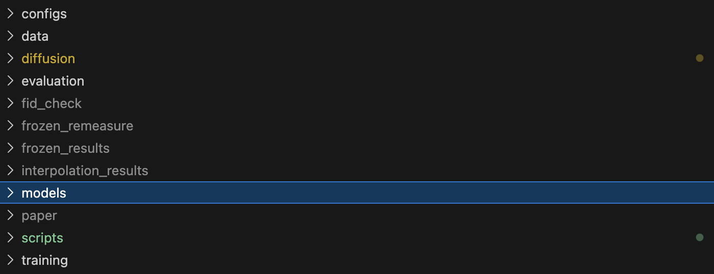
전체 코드 베이스는 위 구조를 따른다. Config 폴더 안 yaml파일로 실험의 하이퍼파라미터를 컨트롤하고, diffusion폴더 안의 코드들은 전/역방향 디퓨전 생성을, 모델폴더 안에는 파이토치로 만든 모델 아키텍처 파일들이 있다. 평가 파일에는 FID관련 메소드가 있으며, 스크립트 파일에는 학습 코드들을 조작하기 쉽도록 bash 스크립트가 존재한다.

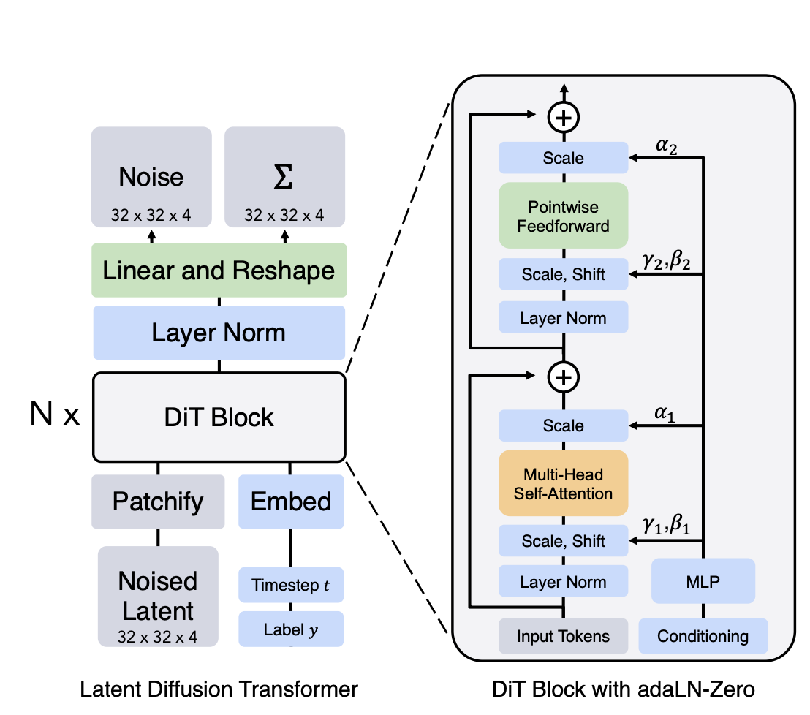
DiT의 개괄적인 네트워크 구조는 위와 같다.

DiT블록은 기본적으로 바닐라 이미지 위에서 학습되지 않고, VAE와 같이 학습된 네트워크가 압축한 latent data위에서 학습과 생성을 진행한다.

안의 DiT 블록은 어텐션 블록과 조건부 디퓨전 구현을 위한 AdaLN (Adaptive Linear Normalization) 시스템이 들어감. 원 논문에서는 조건부 구현을 위해 세가지 옵션을 제시했으나 우리는 이 중 가장 좋다고 알려진 AdaLN을 채택해 구현했다.

출력은 입력된 노이즈낀 latent에서 얼마만큼의 Noise가 꼈는지를 예측하는 방향으로 학습되며, 동시에 공분산 행렬을 출력하게끔 학습되어 손실함수로는 노이즈 예측 손실과 역방향 분포의 KL손실항으로 학습이 된다. 이 때, 가우시안을 가정했기에 공분산만으로 KL을 구할 수 있다.

$$L_{simple} = \mathbb{E}_{t,x_0,\epsilon}\left[\lVert\epsilon - \epsilon_\theta(x_t, t)\rVert^2\right]$$

$$L_{vlb} = \mathbb{E}_{t,x_0,\epsilon}\left[D_{KL}\big(q(x_{t-1}\mid x_t, x_0)\;\big\Vert\;p_\theta(x_{t-1}\mid x_t)\big)\right]$$

$$L_{total} = L_{simple} + \lambda L_{vlb}$$

실험에 필요한 메소드들은 코드로 다음과 같이 구현되었다.


### VAE latent 로드

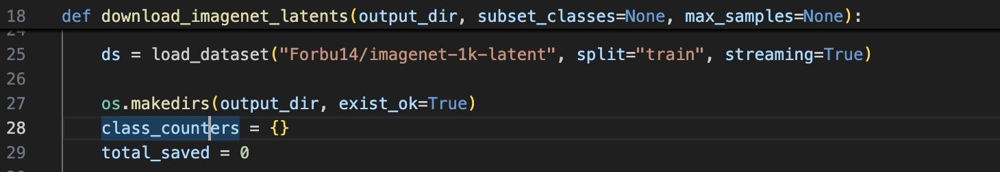
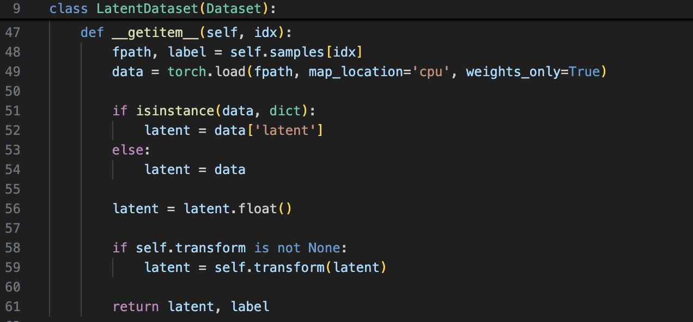
허깅페이스에 공개된 Imagenet 데이터셋의 1000개 라벨 버전 VAE Latent를 이용해 학습했다.

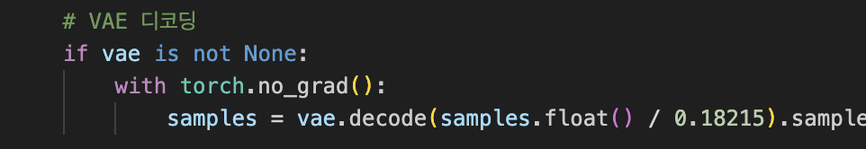
DiT가 복원한 x_pred 역시 VAE의 잠재공간 위의 벡터이기 때문에, FID 계산을 위한 샘플 생성시에는 VAE를 활용해 이미지 레벨로 디코딩한다.


### DiT 블록

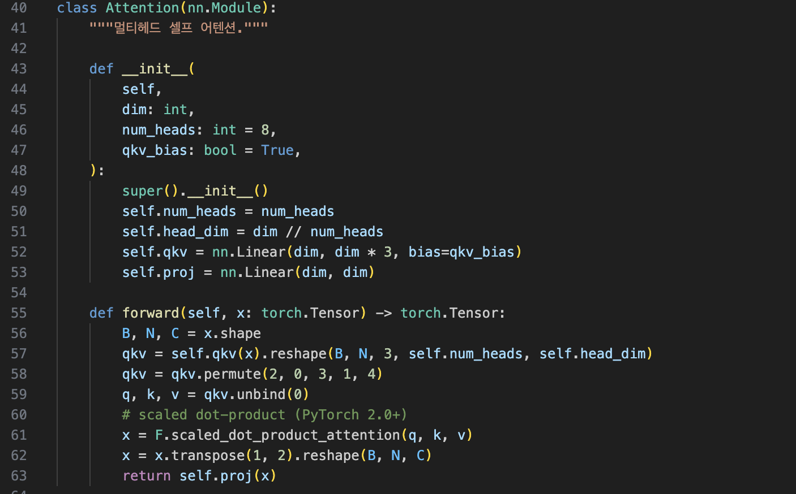
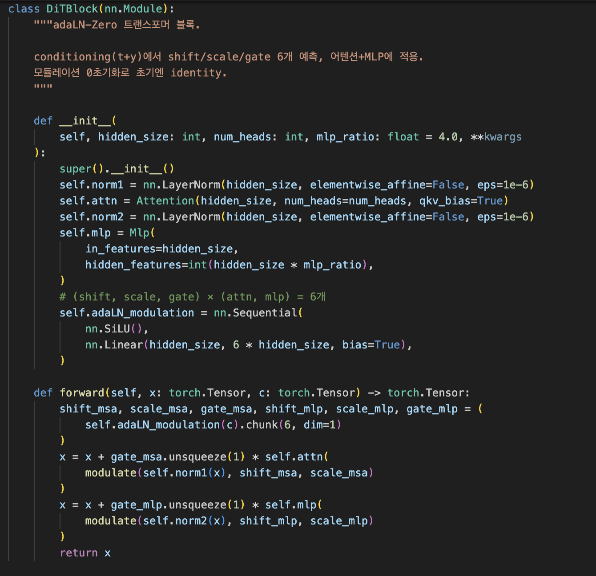
어텐션 블록은 트랜스포머 논문에서 제안된 멀티헤드 어텐션 수식을 파이토치로 구현했다.

$$\text{Attention}(Q,K,V) = \text{softmax}\left(\frac{QK^{T}}{\sqrt{d_k}}\right)V$$

$$\text{head}_i = \text{Attention}(QW_i^{Q},\, KW_i^{K},\, VW_i^{V})$$

$$\text{MultiHead}(Q,K,V) = \text{Concat}(\text{head}_1,\dots,\text{head}_h)\,W^{O}$$

adaLN_modulation 레이어에서 조건 임베딩을 입력받아 LN에 필요한 6개의 파라미터(위 그래프의 알파 감마 베타 각 2개씩)를 뽑아서 LayerNorm출력을 변조한다. Layer Norm은 modulate() + gate 스케일링으로 구현됨.

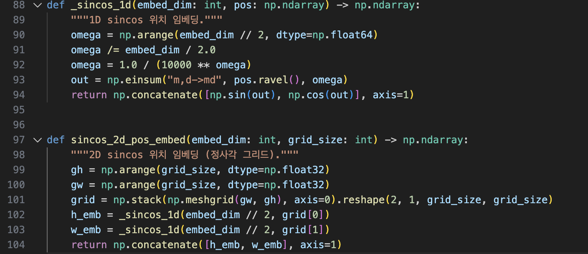
위치 임베딩은 sin cos을 이용한 위치임베딩을 구현했으며, 특기할 점은 DiT의 경우 기본적으로 이미지 위에서동작하기 때문에 국소 정보 포착이라는 CV분야의 전통적인 inductive bias를 추가하기 위해 2차원 위치 임베딩을 별도로 구현했다. 1차원 위치 임베딩은 t(시간) 임베딩등에 사용되었고 2차원임베딩은 레이턴트에 주입되었다.

이 외에도 시간이나 CFG 구현을 위한 라벨 조건을 임베딩하는 부분이 구현되어있다.


### AdaLN

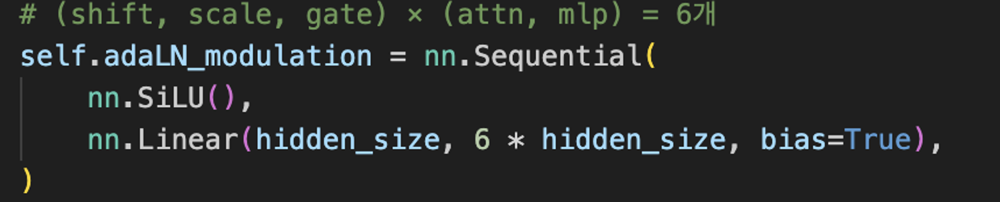
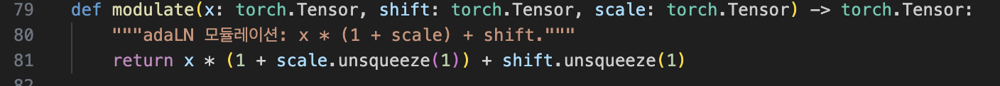
앞선 DiT블록 내부의 AdaLN이 어떻게 구현됐는지 좀 더 자세히 살펴보자.

시간과 조건부 임베딩이 c변수로 압쳐져 adaLN_modulation() 블록에 입력되면 위와 같이 6개의 Layer norm을 위반 파라미터들을 출력하게끔 학습된다. 그러면 이 파라미터들이 modulate 함수로 들어가 위와같이 전형적인 정규화 수식을 계산해 LayerNorm을 구현한다.

이때, AdaLN은 학습 도중 전역적으로 영향을 끼치기 때문에 학습 도중 분산이 너무 커지면 학습 전체가 붕괴할 위험이 있다.

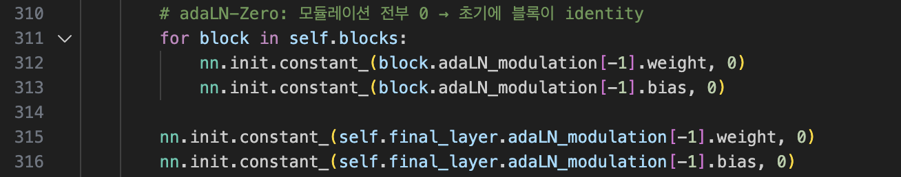
떄문에 AdaLN_modulation블록의 모든 가중치와 편향은 초기에 0으로 초기화되어 항등함수로 동작한다.

$$\frac{\partial L}{\partial W} = \frac{\partial L}{\partial \alpha}\cdot\frac{\partial \alpha}{\partial W} = \frac{\partial L}{\partial \alpha}\cdot c^{T}$$

이때, 역전파 수식은 위와 같다. W가 0이더라도, 출력값 알파는 항등함수의 출력이므로 0이 아니고, 마찬가지로 L역시 모델 전체의 손실이므로 0이 아니고, 조건 임베딩 c역시 0이 아니므로 편미분의 체인룰에 의해 W파라미터는 학습이 가능하다. 때문에 AdaLN관련 모든 파라미터가 0으로 초기화되더라도 학습에 따른 최적화가 가능하고, 초기에 항등함수로 시작하기 때문에 안정한 수렴에 기여한다.


### 모델 파이프 라인 및 출력

최종적인 모델 객체의 순전파 함수는 논문에서 제시한 대로 구현되어있다.

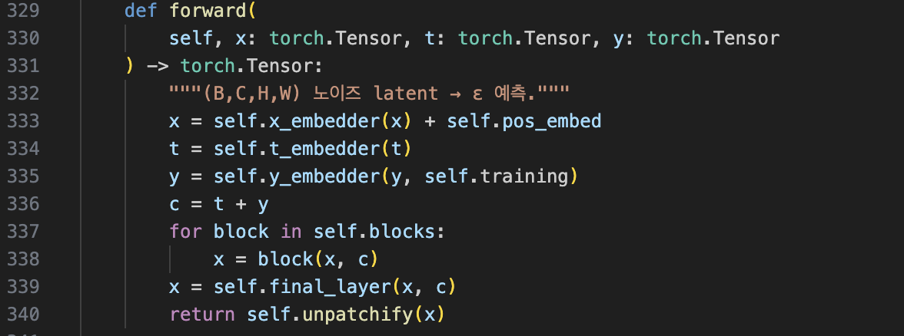
이때, 최종 출력은 (B,8,32,32) 사이즈의 텐서이고, 이는 4개 크기의 노이즈와 공분산행렬의 가중치에 해당하는 값으로 분리된다.


### 손실함수

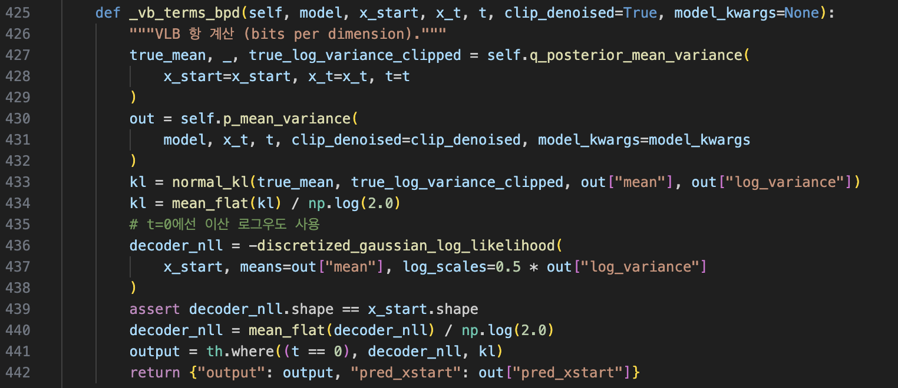
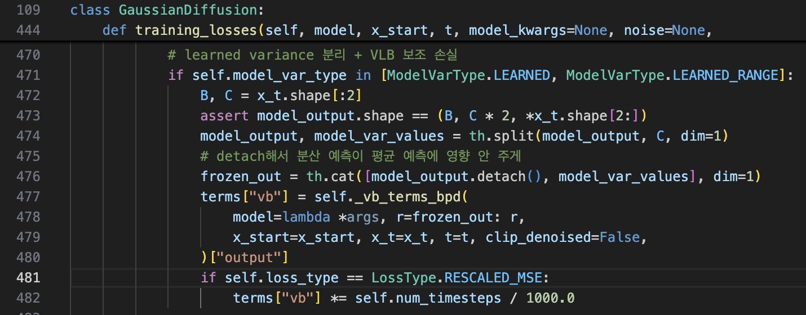
위 코드의 474번째 줄에서 모델의 출력을 분산 보간 항과 노이즈 예측항으로 분리한 후, 이 보간값을 이용해 실제 분포와 예측 분포간 KL div를 계산한다. KL 계산 함수는 425~442번째 줄에 구현이 되어있으며, 특기할 점 두가지는 첫번째로, KL손실 계산에 노이즈 예측이 들어가는데, 노이즈는 MSE Loss로만 학습되도록 해야 학습이 교란되지 않으니 KL계산을 위한 노이즈는 detach한다. 두번째로, t=0일때는 완전히 뾰족한 디랙델타분포를 출력해 KL계산에 오류가 나기 때문에 이산 로그우도로 따로 구하게끔 구현했다.


### CFG 생성

DiT 모델의 평가에는 FID지표를 사용한다.

FID는 실제 이미지넷의 데이터 분포와 학습된 DiT모델이 생성한 분포간 프레셰 거리를 이용해 계산한다.

$$\text{FID} = \lVert\mu_r - \mu_g\rVert^2 + \text{Tr}\left(\Sigma_r + \Sigma_g - 2(\Sigma_r\Sigma_g)^{1/2}\right)$$

이를 위해서는 DiT를 학습시킨후 생성 분포를 만드는 작업이 필요하다. 때문에 5만장을 생성한 후 FID를 측정한다.

생성할 때는 CFG (Classifier Free Guidance)를 이용한다. AdaLN을 이용한 조건부 생성이 가능하기 때문에, 별도의 판별기 없이 특정 클래스의 샘플을 생성할 수 있다.

$$\hat{\epsilon}_\theta(x_t, c) = \epsilon_\theta(x_t, \varnothing) + w\big(\epsilon_\theta(x_t, c) - \epsilon_\theta(x_t, \varnothing)\big)$$

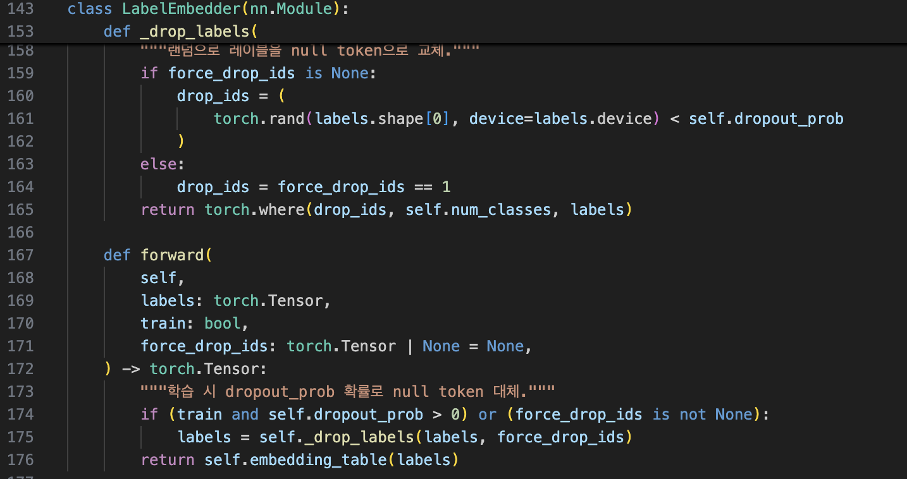
이 CFG를 위한 구현을 위해서는 무조건부 생성도 가능해야하므로, 학습시 10%의 확률로 클래스 토큰을 Null Token으로 대체해 무조건부 생성을 학습시킨다.

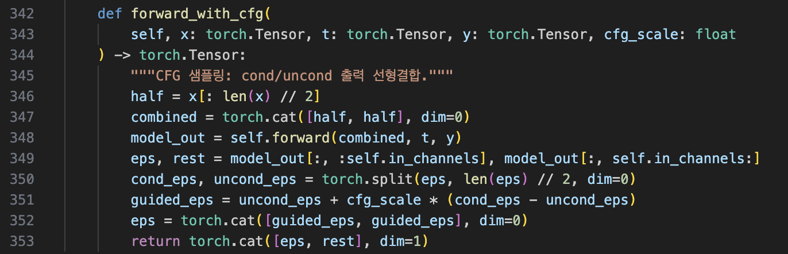
CFG수식을 위와 같은 함수로 구현했다. 기본적으로 Guidance Scale은 4로 설정 되어 있다.


### 생성과정

생성은 역방향 샘플링으로 구현되어있다.

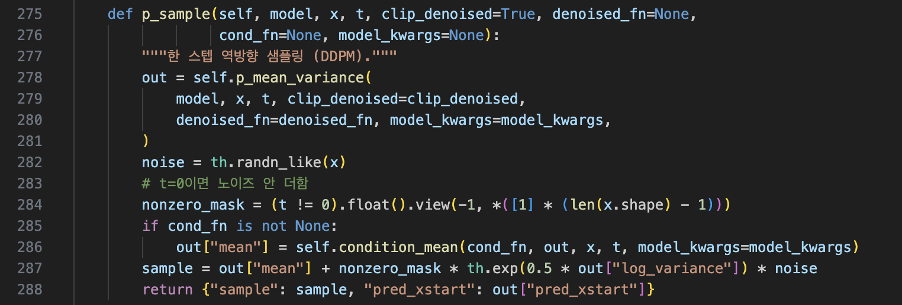
역방향 샘플링의 한 스텝은 p_sample()에 구현되어 있다. 모델이 예측한 $\mu_\theta$ 와 $\sigma_\theta$ 를 이용해 $x_{t-1} = \mu_\theta(x_t, t) + \sigma_\theta z$ 를 계산한다. t=0일 때는 노이즈를 더하지 않도록 마스킹한다.

이 p_sample을 1000번 반복하며 타임스텝을 거꾸로 진행하며 샘플링하는 과정을 구현했다.

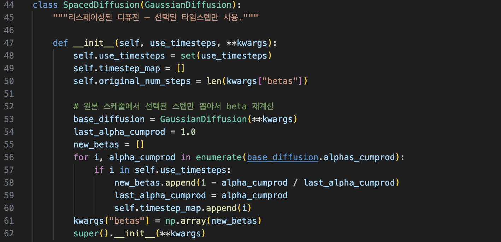
학습은 1000스텝 전체에서 이루어지지만 생성 시에는 SpacedDiffusion을 통해 250스텝으로 가속한다. space_timesteps()가  루프가 250번만 돌면서도 원본과 동일한 노이즈 스케줄을 유지한다. 모델에는 _WrappedModel이 리스페이싱 인덱스(0~249)를 원본 타임스텝(0, 4, 8, ..., 996)으로 변환해서 전달하므로, 모델 자체는 리스페이싱을 인지하지 못한다.

이 과정을 통해 모델이 VAE의 Latent space위의 데이터를 복구하면 VAE 디코더를 이용해 이미지 공간위로 복원한다.


---

## HiT — Method

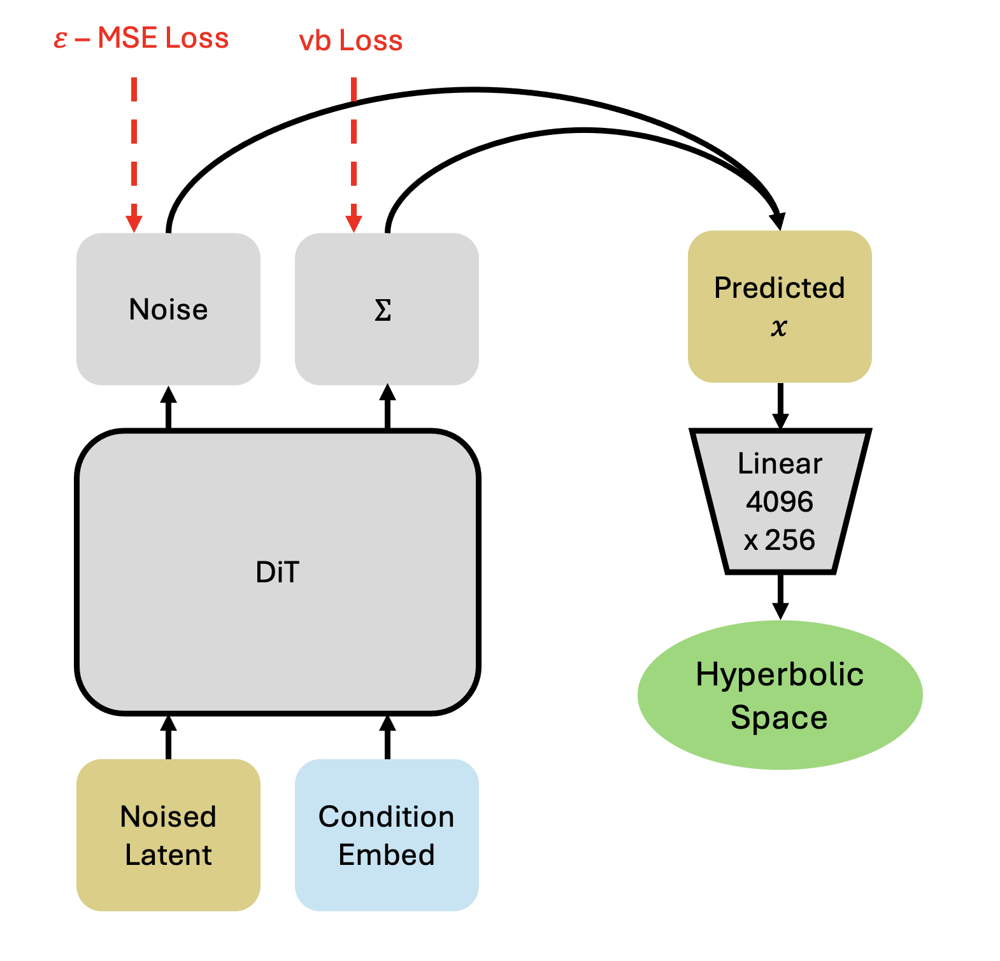
공통 파이프라인은 다음과 같다. 모델의 ε 예측에서 pred_x0를 복원하고, 4096차원이므로 256차원으로 사영한 뒤 지수사상으로 쌍곡공간에 올린다. 코드로는 다음과 같이 구현되었다.

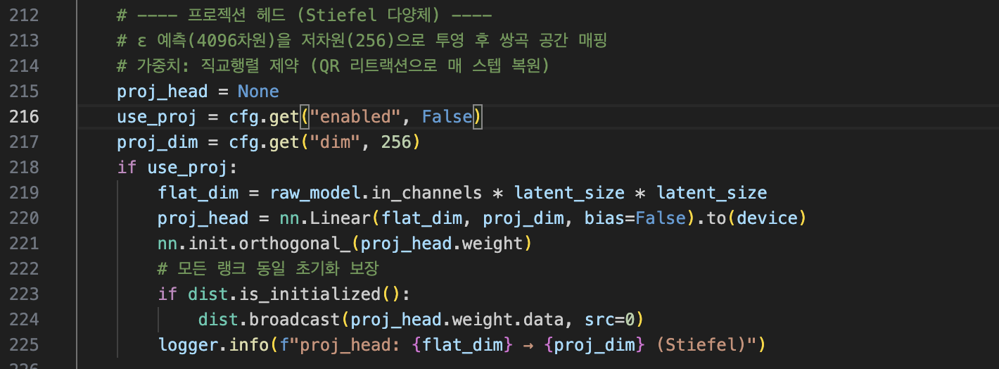
별도의 모델파일이 아닌, 학습 파일 안에 프로젝션 헤드를 붙이도록 구현했다.

이 쌍곡공간 헤드를 통해 손실을 흘려 모델을 제어 시도해볼수도 있고 관측을 해볼 수 있다.

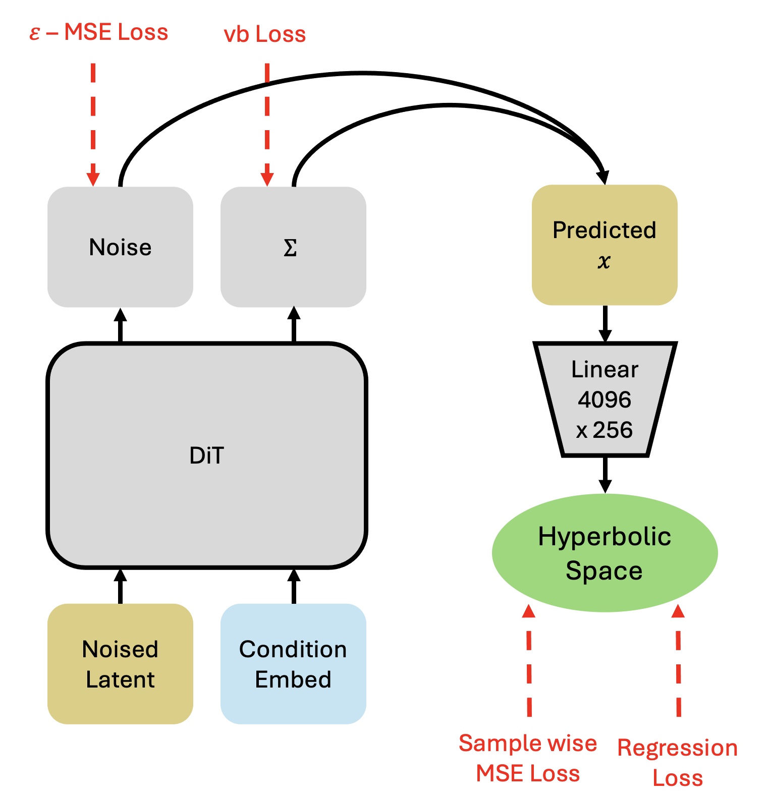
먼저 손실부터,

$$d(z, z^{\ast}) = \frac{2}{\sqrt{c}} \; \text{artanh}\big(\sqrt{c} \; \lVert \ominus z^{\ast} \oplus z \rVert\big)$$

$$L_{hyp} = \mathbb{E}\big[ d(z, z^{\ast})^2 \big]$$

쌍곡공간은 유클리드 공간이 아니기 때문에 거리 측정을 위해 위와 같은 연산을 해야한다. 손실은 단순히 쌍곡공간 위에서 예측한 샘플이 실제 샘플과 얼마나 가까운가를 측정하는 MSE Loss이다. 이런 구조의 손실항은, 모델의 내재적인 잠재공간이 쌍곡공간의 기하학을 따르게끔 유도한다. 이 때, 이 손실의 가장 쉬운 자명해는 0으로 출력하는 항등함수이므로, Linear 레이어가 직교조건을 따르게끔 강제하여 노름이 0으로 수렴하는것을 방지시키는 메소드가 포함되어있다.

$$L_{reg} = \mathbb{E}\left[\left(d^{0}(z) - 2\Big(1 - \frac{t}{T}\Big)\right)^{2}\right]$$

다른 손실은 보다 직접적으로 내 가설의 기하학을 강제하는 규제다. 잠재벡터가 t값에 대해 원점으로부터 선형적으로 감소하도록 강제하는 선형 규제항이다.

측정의 경우, 256차원 쌍곡공간 위의 잠재벡터를 2차원 쌍곡공간위로 UMAP사영한 후 분석하는 정성적 시각화와 256차원 쌍곡공간에서 각 잠재벡터들이 원점들과 t에 대해 거리가 어떻게 되는지를 정량적으로 평가하는 내용이 포함된다. 또한 피어슨 로를 이용하여 가설에 부합하게 실제로 단조하락하도록 정렬되는지도 확인하는 내용이 포함되어있다.

